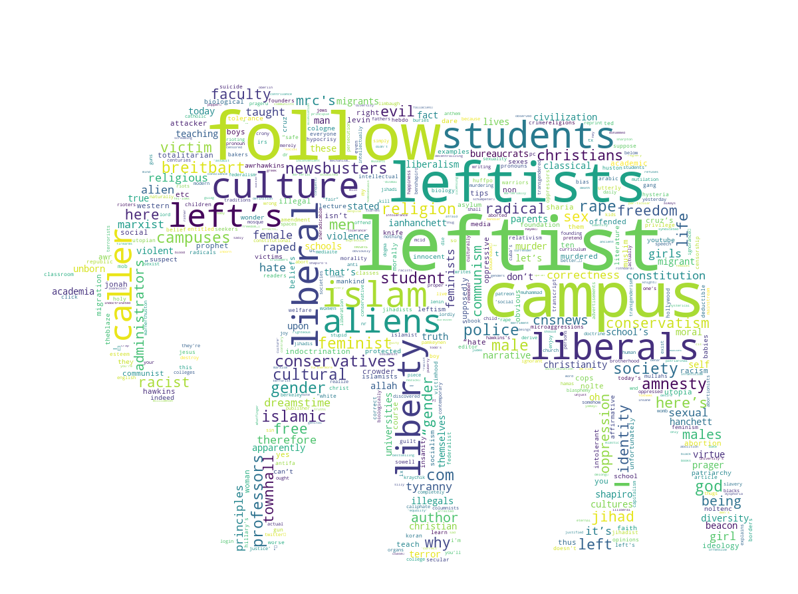
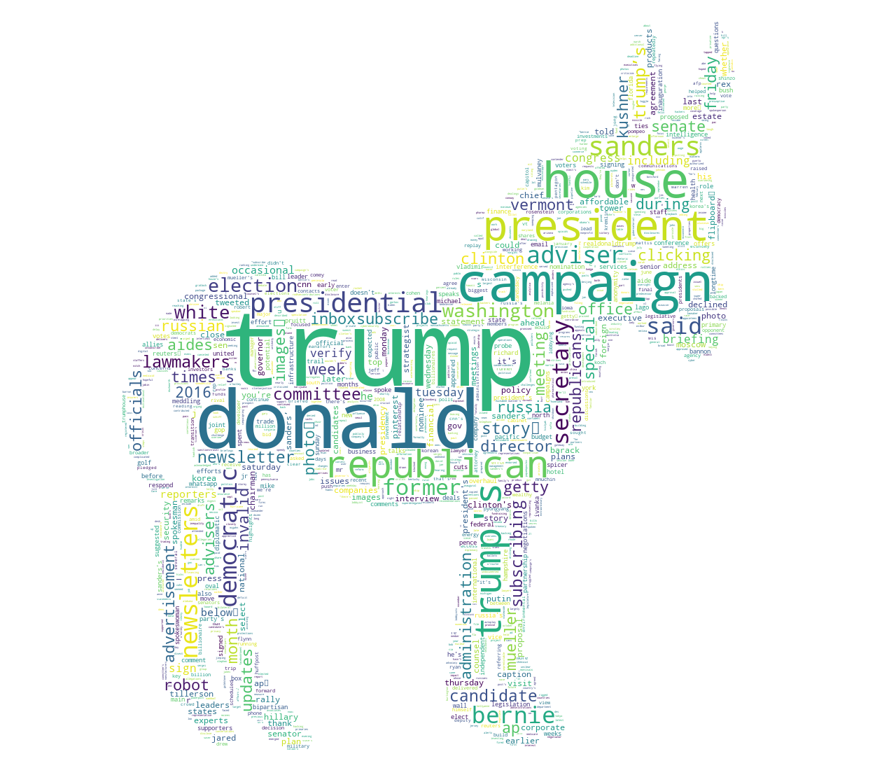

# News-Article-Polarity
Scrape and analyze news articles from conservative and liberal subreddits.
 
## Article Scraping
To scrape articles from reddit, run article_scraper.py from the article_scraping folder.  Use --help to see usage.   

## Articles Analysis
Follow along the jupyter notebooks for analysis.  Partisan wordclouds, showing words which most identify the conservative or liberal bent of an article are shown below.

 

